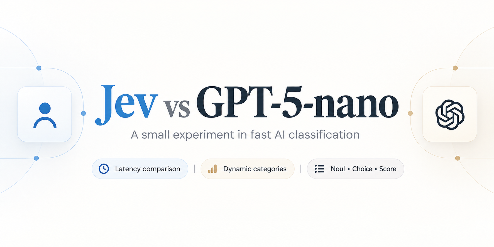

# Jev vs GPT

A three-page game that compares [Jev](https://www.typesafe.ai/) and GPT-5-nano on the same classification task. You pick three categories, type an item, and both engines sort it. The page shows how long each call took.

Repository: https://github.com/fagun98/jev-vs-gpt

Deployed App: https://jev-vs-gpt.vercel.app/

## Pages

1. **Intro** (`/`) — a short welcome and an Enter button.
2. **Categories** (`/categories`) — three fields. Jev checks a field only after you edit it and leave it.
3. **Play** (`/play`) — type an item, or use a quick example. The word drops into a box on the Jev side and the GPT side.

Items that fit none of the three categories go in **Other**.

## Category colors

Each field starts with a blue border. Nothing is checked while every field is empty.

A check runs when you leave a field whose text has changed:

- The field stays blue while Jev is answering.
- It turns **green** when the name is a real category and it does not overlap the other filled names.
- It turns **red** when the name is too vague, or when it overlaps another filled name. A short reason appears under the field: "Too vague" or "Overlaps with {name}".
- Clearing a field skips Jev and puts the border back to blue.

Only the field you just edited is sent to Jev. The other fields keep the color they already have. Start stays off until all three fields are green.

Jev answers in one call:

- **Noul** asks whether the name is a real category, not a vague word. Below 0.5 counts as not valid.
- **Score** asks how much the name overlaps each other filled name. The two levels are "does not overlap" and "overlaps". A score of 0.5 or higher counts as overlap.

## The play round

The play page sends the item and the three category names to both engines. Both are given the same four labels: your three names, plus Other.

- Jev gets one **Choice** question and must pick one label.
- GPT-5-nano gets one sentence listing those same labels and must reply with one label only.

The time on screen is only the model call, from request sent to response received. Each side keeps the current time, the average, the round count, the fastest time, and the slowest time. Jev also shows the confidence percent from its Choice answer.

## Run it locally

Python 3.12 and the packages in `requirements.txt` are enough.

```bash
python3 -m venv .venv
source .venv/bin/activate
pip install -r requirements.txt
cp .env.example .env
```

Put your keys in `.env`. Do not commit that file.

```
TYPESAFE_API_KEY=
OPENAI_API_KEY=
```

`TYPESAFE_API_KEY` is the Jev key from the TypeSafe console. `OPENAI_API_KEY` is the key for GPT-5-nano.

```bash
uvicorn app:app --reload
```

Open http://127.0.0.1:8000.

## Files

| File | What it does |
| --- | --- |
| `app.py` | Serves the three pages, `POST /check`, and `POST /classify`. |
| `classify.py` | Calls Jev and GPT. |
| `pages/index.html` | Intro page. |
| `pages/categories.html` | Category fields and the color check. |
| `pages/play.html` | The side-by-side round. |
| `.env.example` | Blank key names to copy. |

## Deploy

The app is a small FastAPI project, so Vercel can run `app.py` as-is. Set `TYPESAFE_API_KEY` and `OPENAI_API_KEY` in the Vercel project settings. The HTML pages are included with the function through `vercel.json`.
